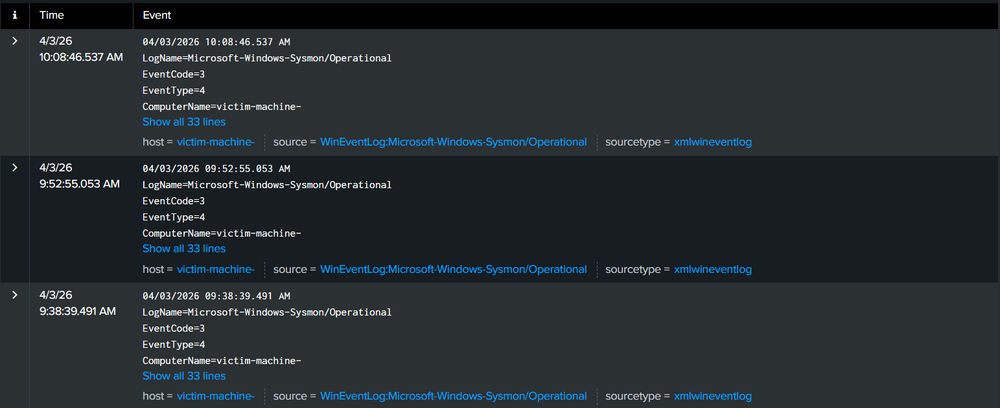
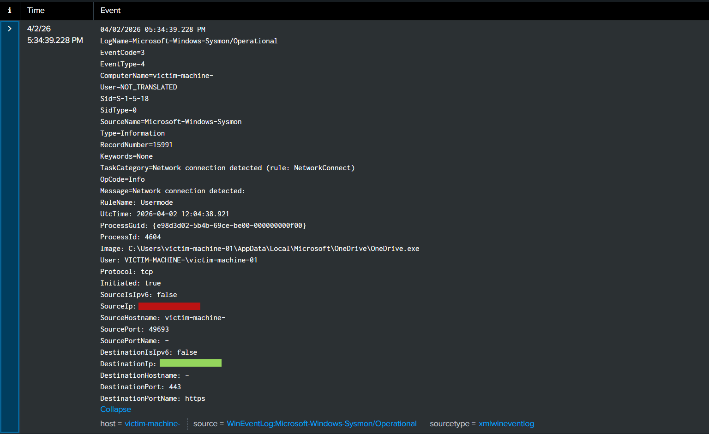
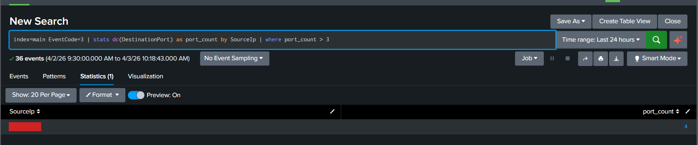

# Reconnaissance Detection using Nmap and Sysmon

## 1. Introduction

In this lab, a reconnaissance activity was simulated using Nmap from an attacker machine to identify open ports on a target Windows system. The objective was to observe how such activity appears in Sysmon logs and how it can be detected using Splunk.

---

## 2. Lab Setup

* Attacker Machine: Kali Linux
* Target Machine: Windows (Sysmon installed)
* SIEM: Splunk
* Network: Host-only + NAT

---

## 3. Attack Simulation

A port scan was performed from the attacker machine using Nmap to discover open ports on the target system.

Commands used:

```
nmap -sS <victim-ip>
nmap -sV <victim-ip>
namp -sT <victim-ip>
```

The scan generated multiple connection attempts to different ports on the target machine.

   
*Figure 1: Nmap scan results identifying open ports on the target system.*

---

## 4. Log Analysis (Sysmon Event ID 3)

Sysmon captured the network activity generated during the scan. Event ID 3 (Network Connection) logs showed multiple connections from a single source IP to different destination ports.

Key observations:

* Same source IP initiating multiple connections
* Different destination ports targeted
* High frequency of connections in a short time


   
*Figure 2 & 3: Activity Detected in Splunk*

---

## 5. Detection in Splunk

A detection query was created to identify potential port scanning behavior by counting unique destination ports accessed by a single source.

Query:

```
index=main EventCode=3
| stats dc(DestinationPort) as port_count by SourceIp
| where port_count > 3
```

This query highlights systems that connect to a large number of ports, which is indicative of scanning activity.

   
---

## 6. MITRE ATT&CK Mapping

* Technique: T1046 – Network Service Discovery

---

## 7. Conclusion

The simulated attack demonstrated how reconnaissance activity can be identified using Sysmon logs. By analyzing network connection patterns in Splunk, it is possible to detect abnormal behavior such as port scanning. This forms the foundation for identifying early-stage attacker activity in a real environment.