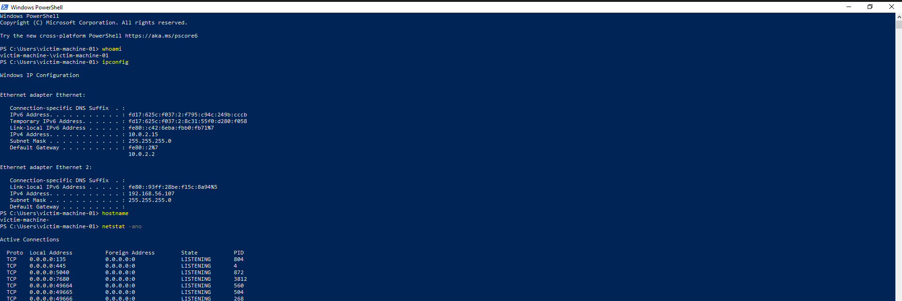
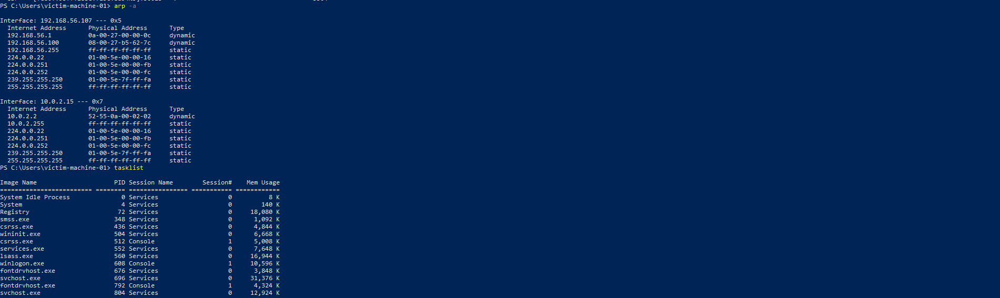
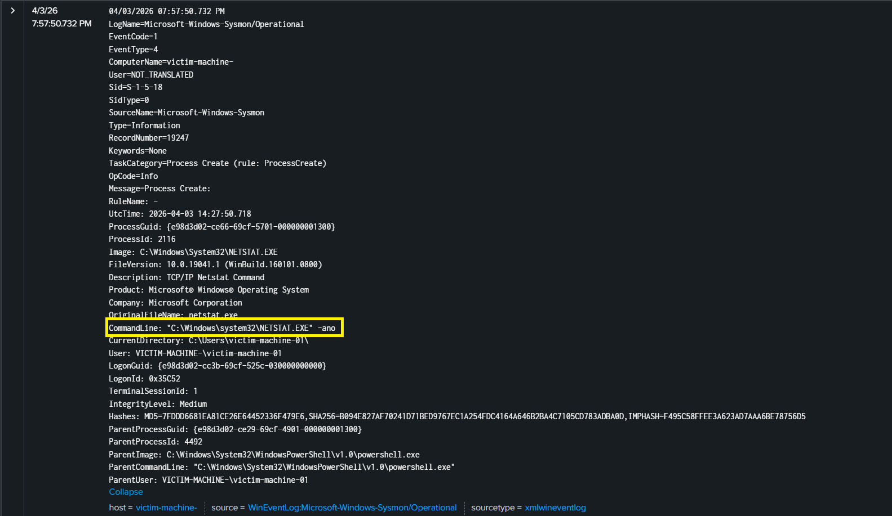

# Process Execution Detection using Sysmon and Splunk

## 1. Introduction

In this lab, command execution activity was simulated on a Windows system to observe how process creation events are logged and analyzed. The goal was to identify suspicious command execution using Sysmon logs and detect it through Splunk.

---

## 2. Lab Setup

* Attacker Simulation: Local command execution
* Target System: Windows with Sysmon installed
* Log Forwarding: Splunk Universal Forwarder
* SIEM: Splunk

---

## 3. Attack Simulation

After gaining access to the system, several commands were executed to simulate attacker behavior. These commands were used to gather system and network information.

Commands executed:

```id="cmds1"
whoami
ipconfig
netstat -ano
tasklist
cmd.exe
dir
echo test
notepad.exe
```

These actions generated process creation events captured by Sysmon.
<div align="center">
  
  
  <p><em>Figure 1 &amp;2: PowerShell Commands.</em></p>
</div>

---

## 4. Log Analysis (Sysmon Event ID 1)

Sysmon Event ID 1 logs process creation activity. The logs captured details such as the process name, command line, parent process, and user.

Key observations:

* Multiple processes executed within a short time
* Use of command-line utilities for system reconnaissance
* Parent-child relationships such as PowerShell spawning cmd.exe

<div align="center">
  
  
  <p><em>Figure 3 &amp; 4: Some Raw Splunk logs for EventCode=1.</em></p>
</div>

---

## 6. Detection Logic

Suspicious process execution can be identified by analyzing:

* Command-line activity
* Execution of administrative tools
* Parent-child relationships between processes

Example detection:

```id="main"
index=main EventCode=1
| search ParentImage="*powershell.exe" Image="*cmd.exe"
```
<div align="center">
  
  <p><em>Figure 5: Example of detecting activites.</em></p>
</div>

</div>
---

## 7. MITRE ATT&CK Mapping

* T1059 – Command and Scripting Interpreter

---

## 8. Conclusion

The simulation demonstrated how process execution activity is captured and analyzed using Sysmon and Splunk. By filtering noise and focusing on relevant fields, it is possible to identify suspicious command execution patterns that may indicate attacker activity.