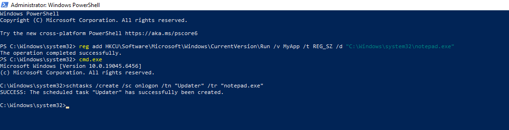
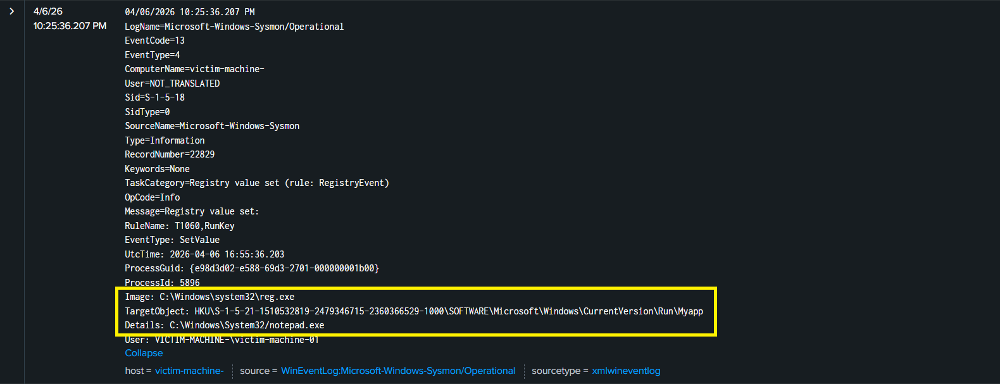
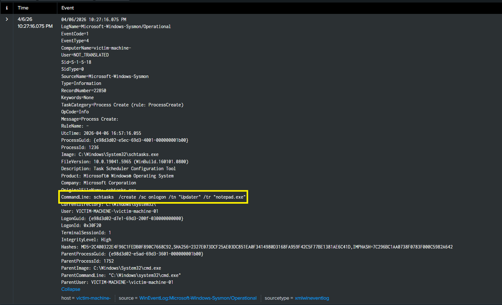
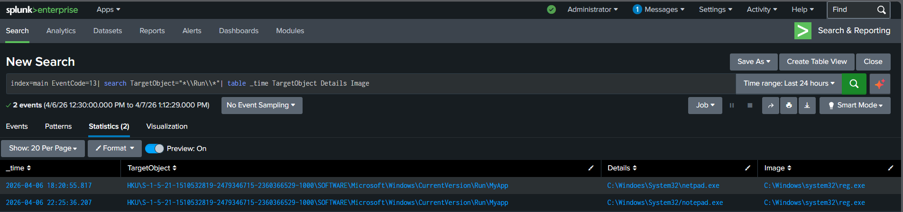
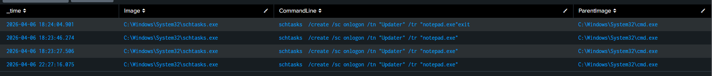

# Persistence Detection using Registry and Scheduled Tasks

## 1. Introduction

In this lab, persistence techniques were simulated on a Windows system to understand how attackers maintain access after initial compromise. The objective was to observe how these actions are recorded in Sysmon logs and how they can be detected using Splunk.

---

## 2. Lab Setup

* Target System: Windows with Sysmon installed
* Log Forwarding: Splunk Universal Forwarder
* SIEM: Splunk

---

## 3. Attack Simulation

### 3.1 Registry Persistence

A registry run key was created to execute a program at user logon.

Command used:

```id="regcmd"
reg add HKCU\Software\Microsoft\Windows\CurrentVersion\Run /v MyApp /t REG_SZ /d "C:\Windows\System32\notepad.exe"
```

This ensures that the specified program runs automatically whenever the user logs in.

---

### 3.2 Scheduled Task Persistence

A scheduled task was created to execute a program at logon.

Command used:

```id="schtaskcmd"
schtasks /create /sc onlogon /tn "Updater" /tr "notepad.exe"
```

This creates a persistent mechanism that triggers execution during login.


<div align="center">
  
  <p><em>Figure 1: Registry persistencce key added and executed by notepad & task scheduling in command prompt</em></p>
</div>

---

## 4. Log Analysis

### 4.1 Registry Modification (Sysmon Event ID 13)

Sysmon captured registry modification activity indicating persistence.

Key observations:

* Modification under the Run key
* Value added pointing to executable (notepad.exe)

<div align="center">
  
  <p><em>Figure 2: showing modification of the Run registry key with a new value pointing to notepad.exe.</em></p>
</div>

---

### 4.2 Scheduled Task Creation (Sysmon Event ID 1)

The creation of the scheduled task was recorded as a process execution event.

Key observations:

* Execution of schtasks command
* Command line includes task creation parameters


<div align="center">
  
  <p><em>Figure 3: Sysmon logs capturing execution of the schtasks command.</em></p>
</div>

---

## 5. Detection in Splunk

### Registry Persistence Detection

```
index=main EventCode=13
| search TargetObject="*\\Run\\*"
| table _time TargetObject Details Image
```
<div align="center">
  
  <p><em>Figure 4:  Detection results identifying Registry Persistence activity</em></p>
</div>

---

### Scheduled Task Detection

```
index=main EventCode=1
| search CommandLine="*schtasks*"
| where NOT like(CommandLine, "%splunk%")
| table _time Image CommandLine ParentImage
```

These queries help identify persistence mechanisms by monitoring registry changes and task creation activity.


<div align="center">
  
  <p><em>Figure 4:  Detection results identifying scheduled task creation activity</em></p>
</div>

---

## 6. MITRE ATT&CK Mapping

* T1547 – Boot or Logon Autostart Execution
* T1053 – Scheduled Task/Job

---

## 7. Conclusion

The simulation demonstrated how attackers establish persistence using registry keys and scheduled tasks. By monitoring these activities through Sysmon and analyzing them in Splunk, it is possible to detect and investigate persistence mechanisms effectively.