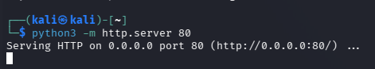
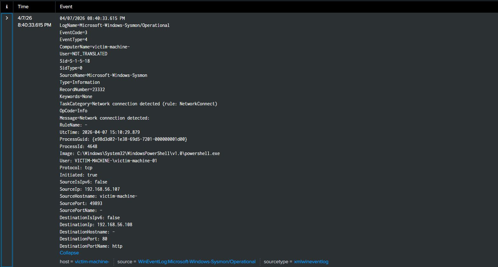
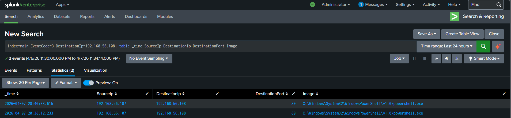
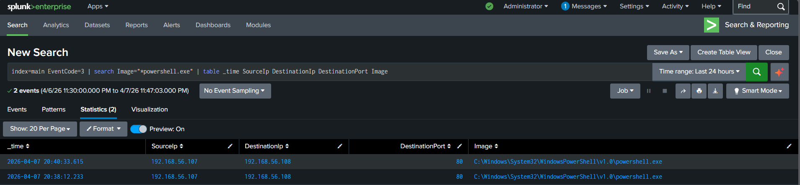

# C2 Communication Detection using Sysmon and Splunk

## 1. Introduction

In this lab, outbound network communication was simulated from a Windows system to an external host to represent command-and-control (C2) activity. 

The objective was to observe how such communication is logged by Sysmon and how it can be detected using Splunk.

---

## 2. Lab Setup

* Attacker System: Kali Linux (HTTP server)
* Target System: Windows with Sysmon installed
* Log Forwarding: Splunk Universal Forwarder
* SIEM: Splunk

---

## 3. Attack Simulation

A simple HTTP server was started on the attacker machine. The victim system initiated a connection using PowerShell to simulate outbound communication.

Commands used:

Kali:

```id="kali1"
python3 -m http.server 80
```
<div align="center">
  
  <p><em>Figure 1: C2 server formation</em></p>
</div>

Windows:

```
curl http://<attacker-ip>:
```

The request successfully returned a response from the attacker-controlled server, confirming connectivity.

<div align="center">
  
  <p><em>Figure 2:  Connecting c2 communication with windows</em></p>
</div>

---

## 4. Log Analysis (Sysmon Event ID 3)

Sysmon captured the network connection generated by the request.

Key observations:

* Outbound connection from victim system
* Destination IP corresponds to attacker machine
* Connection made over HTTP port (80)
* Process involved: PowerShell

<div align="center">
  
  <p><em>Figure 3: Sysmon captured the network conncetion</em></p>
</div>

---

## 5. Detection in Splunk

### Specific C2 Communication

```
index=main EventCode=3 DestinationIp=<attacker-ip>
| table _time SourceIp DestinationIp DestinationPort Image
```
<div align="center">
  
  <p><em>Figure 4: Decting attack with splunk</em></p>
</div>
---

### PowerShell-Based Network Activity

```
index=main EventCode=3
| search Image="*powershell.exe"
| where NOT like(Image, "%splunk%")
| table _time SourceIp DestinationIp DestinationPort Image
```
<div align="center">
  
  <p><em>Figure 5:  Detcted powershell based network activity</em></p>
</div>

---

## 6. MITRE ATT&CK Mapping

* T1071 – Application Layer Protocol

---

## 7. Conclusion

The simulation demonstrated how outbound communication to an external system can be detected using Sysmon logs. Even when using common protocols like HTTP, unusual processes such as PowerShell initiating connections can indicate suspicious behavior. Monitoring such activity is essential for identifying potential command-and-control communication.