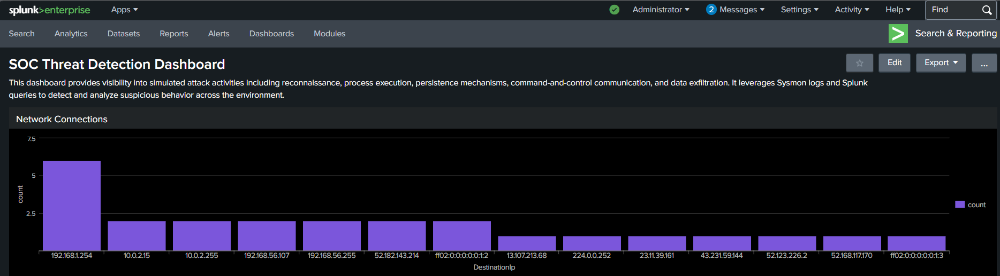
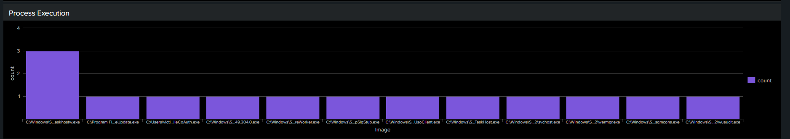
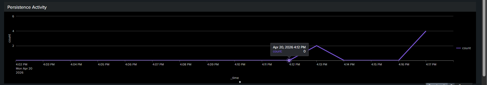
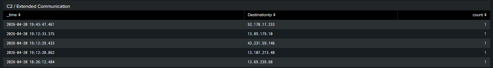
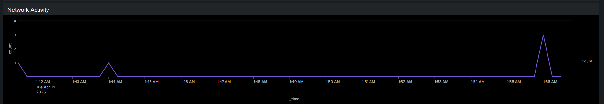

# SOC Monitoring Dashboard using Splunk

## 1. Introduction

In this lab, a centralized dashboard was created in Splunk to monitor and visualize security events generated during multiple attack simulations. The goal was to provide a clear overview of system activity and highlight suspicious behavior across different stages of an attack.

---

## 2. Objective

* Visualize attack activity in real time
* Correlate logs from different attack stages
* Identify suspicious patterns using dashboards

---

## 3. Dashboard Overview

The dashboard consolidates logs from Sysmon and displays them in multiple panels for better visibility and analysis.


---

## 4. Panels Description

### 4.1 Network Connections

Displays communication between systems, helping identify suspicious external connections.

```
index=main EventCode=3
| stats count by DestinationIp
| sort -count
```

<div align="center">
  
  <p><em>Figure 1: Network connections seen during the simulation, showing how the system talked to other systems.</em></p>
</div>
---

### 4.2 Process Execution

Shows processes executed on the system, useful for identifying suspicious activity such as PowerShell usage.

```spl
index=main EventCode=1
| stats count by Image
| sort -count
```

<div align="center">
  
  <p><em>Figure 2: Activity during the attack simulation showing the commands and tools that were used to run the process.</em></p>
</div>

---

### 4.3 Persistence Activity

Highlights registry modifications and scheduled task creation.

```spl id="d3"
index=main (EventCode=13 OR EventCode=1)
| search TargetObject="*\\Run\\*" OR CommandLine="*schtasks*"
| where NOT like(CommandLine, "%splunk%")
| stats count by Image
```

<div align="center">
  
  <p><em>Figure 3: Activities related to persistence, such as changing the registry and making scheduled tasks.</em></p>
</div>

---

### 4.4 C2 Communication

Identifies outbound connections initiated by scripting tools such as PowerShell.

```
index=main EventCode=3
| search Image="*powershell.exe"
| where NOT like(Image, "%splunk%")
| stats count by DestinationIp
| sort -count
```

<div align="center">
  
  <p><em>Figure 4: PowerShell started an outbound communication, which could mean that command-and-control activity is going on.</em></p>
</div>
---

### 4.5 Timeline Analysis

Visual representation of activity over time, highlighting spikes during attack simulation.

```spl 
index=main EventCode=3
| timechart count span=30s
```

<div align="center">
  
  <p><em>Figure 5: A timeline of network activity showing spikes that match up with simulated attack events.</em></p>
</div>

---

### 4.6 Recent Activity

Displays latest events with timestamps for quick investigation.

```spl 
index=main (EventCode=1 OR EventCode=3)
| table _time EventCode Image DestinationIp CommandLine
| sort -_time
```


<div align="center">
  
  <p><em>Figure 5: Example of detecting activites.</em></p>
</div>


## 5. Analysis

The dashboard provides a consolidated view of system activity, allowing detection of:

* Multiple network connections to external systems
* Execution of command-line tools such as PowerShell
* Persistence mechanisms through registry and scheduled tasks
* Spikes in activity corresponding to attack simulation

---

## 6. Conclusion

The dashboard effectively visualizes attack behavior across different stages. By combining multiple log sources and presenting them in a structured format, it enhances the ability to detect and investigate suspicious activity in real timeq 3456y754321`